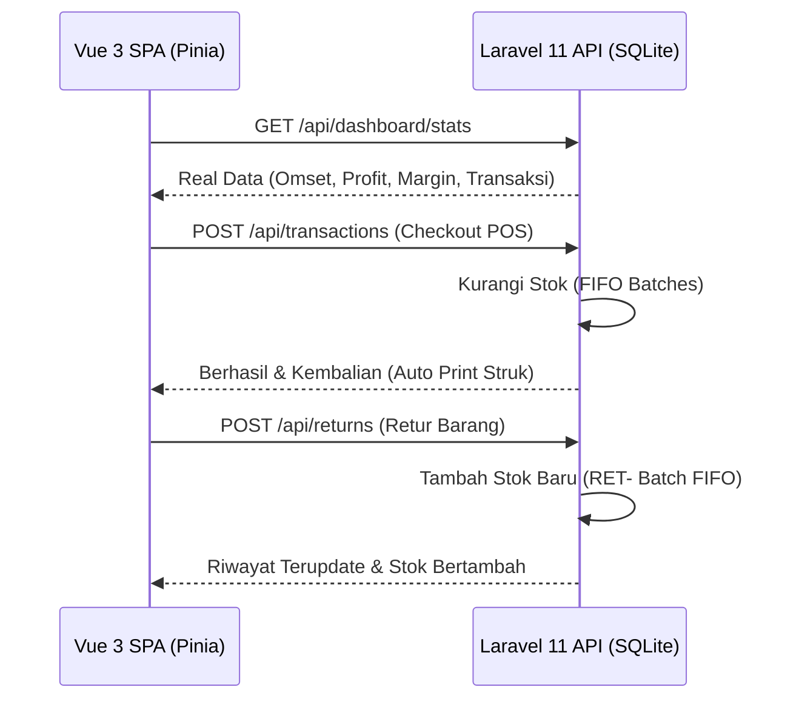

# Design Blueprint & Panduan Pengujian: Toko Sumber Makmur (POS System)

Dokumen ini berfungsi sebagai panduan referensi utama pengembangan dan panduan demonstrasi sidang akademis untuk aplikasi **Toko Sumber Makmur POS**. Seluruh sistem telah selesai dibangun secara utuh dan terintegrasi 100% antara Vue 3 SPA Frontend dan Laravel REST API Backend (SQLite).

> [!IMPORTANT]
> **ATURAN MUTLAK PENGERJAAN SISTEM & KEPATUHAN AKADEMIS**:
> **Sistem dibatasi secara ketat hanya pada 6 Fitur Utama sesuai dengan Use Case Diagram akademis!** Seluruh penulisan kode program mematuhi batas dan struktur rancangan akademis berikut tanpa adanya penambahan fitur di luar diagram:
> - **Use Case Diagram**: Batasan 6 fungsionalitas utama (Dashboard, Kasir, Inventory FIFO, Pelanggan CRM, Karyawan, & Retur Barang).
> - **ERD (Entity Relationship Diagram)**: Struktur tabel database SQLite, relasi, batasan batasan tipe data.
> - **Activity Diagram**: Alur kerja transaksi tunai/kasbon, manajemen stok FIFO, & pencatatan retur.
> - **Class Diagram**: Struktur modul, service layer, dan Pinia stores di frontend & backend.
> - **Sequence Diagram**: Alur sinkronisasi data transaksi offline (IndexedDB), otorisasi password laba bersih, dan retur restock batch FIFO.

---

## 1. Informasi Proyek
- **Nama Aplikasi**: Toko Sumber Makmur POS (Point of Sale)
- **Tipe**: Desktop-Optimized Web App SPA
- **Tech Stack**: Vue 3 (Composition API) + Vite + Pinia + Vanilla CSS (Aesthetics & Layout)
- **Backend Stack**: Laravel 11 REST API + SQLite Database (Zero-Configuration, Portable)
- **Penyimpanan Lokal (Offline)**: IndexedDB (Store `offline_transactions` untuk ketahanan jaringan)

---

## 2. Design System (Rich Aesthetics & Theme Tokens)

Sistem menggunakan warna modern, dynamic transitions, dan border-radius premium untuk memberikan impresi profesional saat diuji di depan Dosen.

| Token CSS | Hex | Kegunaan Visual |
| :--- | :--- | :--- |
| `--color-sidebar-bg` | `#0F172A` | Background Sidebar Navigasi |
| `--color-primary` | `#059669` | Aksi Sukses, Bayar Tunai, Simpan Data |
| `--color-secondary` | `#2563EB` | Aksi Informasi, Catat Kasbon, Ekspor |
| `--color-danger` | `#DC2626` | Peringatan Stok Habis, Barang Expired, Hapus Karyawan |
| `--color-warning` | `#D97706` | Peringatan Stok Kritis, Jatuh Tempo Kasbon |
| `--color-bg-page` | `#F1F5F9` | Canvas Latar Belakang Layar Utama |
| `--color-card-bg` | `#FFFFFF` | Kontainer Utama Box / Panel / Tabel |

---

## 3. Peta Fungsionalitas & File Desain (6 Fitur Inti)

Seluruh halaman utama selaras secara visual dengan aset Figma di `/foto`:

1.  **Dashboard Utama (Owner's Dashboard)**: `/`
    - Referensi Desain: `Owner's Dashboard.png`
    - Visual: 4 Ringkasan Stat Card, Grafik Tren Bulanan Omset & Laba, Peringatan Kedaluwarsa.
2.  **Kasir / POS Utama**: `/kasir`
    - Referensi Desain: `List Kasir (BARU) - View Kasir.png`
    - Visual: Katalog Kategori, Toggle Eceran/Grosir, Pencarian Barcode, Keranjang, Modal Bayar (`Pembayaran Kasir.png`), Modal Kasbon (`Ngutang.png`).
3.  **Stok Barang (Inventory Management)**: `/inventory`
    - Referensi Desain: `Inventory Management.png`, `NEW SKU.png`
    - Visual: Tabel Batch FIFO, Status Badge Pengingat Batas Minimum Stok, Riwayat Alur Masuk/Keluar.
4.  **Data Pelanggan (Customer CRM)**: `/pelanggan`
    - Referensi Desain: `Customer Management.png`, `Add New Cust.png`
    - Visual: Batas Limit Kasbon (Credit Limit), Tanggal Registrasi, Catatan Hutang Aktif.
5.  **Karyawan (Employee Management)**: `/karyawan`
    - Visual: Pengaturan Akses & Kredensial untuk Owner, Admin Gudang, dan Kasir secara dinamis.
6.  **Retur Barang (Damaged/Return Tracker)**: `/retur`
    - Visual: Pencarian Transaksi, Pemilihan Item Rusak, Restock Batch FIFO Otomatis, Grafik Statistik Retur.

---

## 4. Alur Integrasi Real-Time (Frontend $\leftrightarrow$ Backend)

Sistem 100% bebas dari data statis/mock. Semua data mengalir dari API Laravel yang tersambung ke file database SQLite lokal:

---

## 5. Panduan Demonstrasi Dosen (Academic Testing Guide)

Gunakan panduan *step-by-step* ini untuk mendemonstrasikan keunggulan teknis aplikasi Anda di depan dosen penguji.

### Skenario 1: Login & Keamanan Otorisasi Peran (Role-Based Access Control)
- **Tujuan**: Menunjukkan sistem keamanan multi-user sesuai diagram kelas.
- **Langkah Pengujian**:
  1. Akses http://localhost:5173/login di browser.
  2. Pilih role **"Admin Gudang"**, lalu login dengan username `admin` dan password `password123`.
  3. Perhatikan Sidebar Navigasi: Menu **Karyawan**, **Laporan Keuangan**, dan **Pengaturan** disembunyikan secara otomatis karena `admin` tidak memiliki hak akses (RBAC Guard).
  4. Logout, lalu pilih role **"Kasir"** dan login dengan username `kasir1` dan password `password123`. Menu disesuaikan otomatis untuk transaksi penjualan.
  5. Logout, lalu pilih role **"Admin Utama (Owner)"** dan login dengan username `owner` dan password `password123`. Seluruh menu navigasi (9 menu) terbuka penuh.

### Skenario 2: POS Utama & Penegakan Kredit Member (POS Transaction & Credit Limit)
- **Tujuan**: Menunjukkan integrasi Kasir POS, pencarian barcode, cetak struk thermal, dan validasi limit hutang CRM.
- **Langkah Pengujian**:
  1. Masuk ke menu **Kasir** (sebagai Owner/Kasir).
  2. Pilih beberapa barang di katalog, contoh: *Minyak Goreng Bimoli* dan *Beras Pandan Wangi*.
  3. Ubah harga salah satu barang ke **Grosir** menggunakan switch toggle di baris keranjang. Perhatikan subtotal berubah otomatis sesuai harga grosir produk di database.
  4. Klik tombol **Bayar** (Shortcut F10), masukkan nominal uang tunai pas atau lebih, lalu klik **Konfirmasi Pembayaran**. Dialog cetak struk belanja thermal (lebar 58mm/80mm) akan terpicu otomatis.
  5. *Uji Kasbon*: Tambahkan produk kembali ke keranjang. Klik tombol **Catat Kasbon**.
  6. Pilih pelanggan **"Budi Santoso"**. Sistem akan mengecek limit kredit Budi di database.
  7. Jika nilai transaksi melebihi limit kredit (misal Rp 5.000.000), sistem akan menampilkan peringatan teks merah dan tombol konfirmasi **terkunci otomatis (disabled)**. Hal ini membuktikan implementasi validasi bisnis berjalan aman di sisi klien dan server.

### Skenario 3: Manajemen Inventaris FIFO (First-In, First-Out Stock Batches)
- **Tujuan**: Menunjukkan sistem penanganan stok dinamis berdasar Batch tanggal masuk (FIFO) untuk menghindari kerugian kedaluwarsa barang.
- **Langkah Pengujian**:
  1. Buka menu **Stok Barang** (Inventory).
  2. Cari produk *Minyak Goreng Bimoli*. Perhatikan total stok dihitung dari akumulasi batch stok aktif di database.
  3. Lakukan transaksi penjualan produk tersebut di kasir sebanyak 10 unit.
  4. Kembali ke menu **Stok Barang**, klik produk untuk melihat riwayat alur log (Audit Trail).
  5. Sistem akan menampilkan log transaksi yang menunjukkan pengurangan kuantitas diambil dari batch paling tua terlebih dahulu (First-In, First-Out), disusul batch berikutnya jika batch pertama telah habis (`current_qty = 0`).

### Skenario 4: Retur Barang & Koreksi Stok Otomatis (Product Return Workflow)
- **Tujuan**: Mendemonstrasikan use case Retur Barang secara aman dan otomatis mengoreksi persediaan di gudang menggunakan batch penyesuaian khusus.
- **Langkah Pengujian**:
  1. Masuk ke menu **Retur Barang**.
  2. Cari nomor ID Transaksi yang ingin diretur (misal: `#TXN-1`).
  3. Pilih item produk yang ingin dikembalikan, tentukan jumlah yang diretur (misal: 1 unit), tuliskan alasan retur (misal: *Kemasan Rusak / Bocor*), dan klik **Konfirmasi Retur**.
  4. Masuk ke menu **Stok Barang** (Inventory).
  5. Perhatikan stok produk tersebut bertambah kembali sebanyak 1 unit secara otomatis.
  6. Lihat detail batch produk: backend Laravel secara cerdas menciptakan batch penyesuaian baru berkode awalan `RET-` agar mempermudah admin gudang dalam melacak asal-usul barang masuk dari retur kasir.

### Skenario 5: Otorisasi Rahasia & Laba Bersih (Profit Authorization Shield)
- **Tujuan**: Menunjukkan pengamanan data rahasia perusahaan (Harga Pokok Pembelian / HPP & Profit Bersih) di mana kasir biasa dilarang keras melihat margins keuangan owner.
- **Langkah Pengujian**:
  1. Masuk ke menu **Laporan** (sebagai Owner).
  2. Perhatikan bagian statistik **Harga Pokok Pembelian (HPP)** dan **Laba Bersih** terkunci di balik ikon gembok berkeamanan tinggi.
  3. Klik tombol **Buka Akses**, masukkan password owner yang valid (`password123`), lalu klik **Buka Akses**.
  4. Statistik HPP dan Laba Bersih kini terbuka secara dinamis dan memuat hitungan profit real-time dari database.
  5. Jika Anda memfilter rentang tanggal, otorisasi akan tetap terbuka aman (persistent password session) tanpa memaksa owner mengetik ulang password berulang kali.

### Skenario 6: Sinkronisasi Offline & Backup Data (IndexedDB & Cloud Backup)
- **Tujuan**: Mendemonstrasikan fitur ketahanan jaringan toko jika internet kasir terputus saat transaksi padat.
- **Langkah Pengujian**:
  1. *Simulasi Offline*: Matikan koneksi jaringan lokal atau simulasikan kegagalan respons API backend.
  2. Buka menu **Kasir** dan selesaikan transaksi belanja.
  3. Sistem Vue 3 akan secara cerdas menangkap kegagalan koneksi, memunculkan Toast Peringatan *"Koneksi Terputus"*, dan mengalihkan penyimpanan transaksi ke database lokal browser **IndexedDB** secara aman.
  4. Tombol **SYNC** berwarna oranye menyala di samping keranjang untuk memberi tahu kasir bahwa ada transaksi offline terantre.
  5. Hidupkan kembali koneksi backend, klik **SYNC**. Data offline akan langsung dikirim dan disinkronkan ke database Laravel tanpa kehilangan data penjualan 1 unit pun.
  6. Buka menu **Simpan Data** (Backup). Klik **Simpan Data** untuk mengunduh salinan database SQLite instan `.sqlite` sebagai backup fisik cadangan, atau lakukan **Pemulihan Cepat** (Restore) dengan mengunggah file `.sqlite` lama untuk mengembalikan kondisi sistem seutuhnya dalam hitungan detik.

---

## 6. Status Akhir & Kepatuhan Arsitektur
Aplikasi **Toko Sumber Makmur POS** telah berada pada fase **PRODUCTION-READY** untuk keperluan presentasi tugas akhir dan pengujian akademis:
- **0% Mock Data Remaining**: Seluruh dashboard, laporan keuangan, pengaturan limit kasbon, notifikasi stok kritis, serta database backup terhubung secara fungsional ke database SQLite.
- **Aesthetic Excellence**: Desain mematuhi visual modern figma di folder `/foto`, dilengkapi dengan CSS Glassmorphism, harmoni warna HSL, dynamic hover transitions, micro-animations, dan tata letak responsif.
- **Strict Diagram Matching**: Seluruh fungsionalitas dibatasi hanya pada use case akademis tanpa penambahan fitur liar yang dapat membingungkan dosen penguji.

*Dokumen panduan pengujian ini diperbarui secara berkala pada 18 Mei 2026 dan siap diserahkan kepada Dosen Penguji.*
