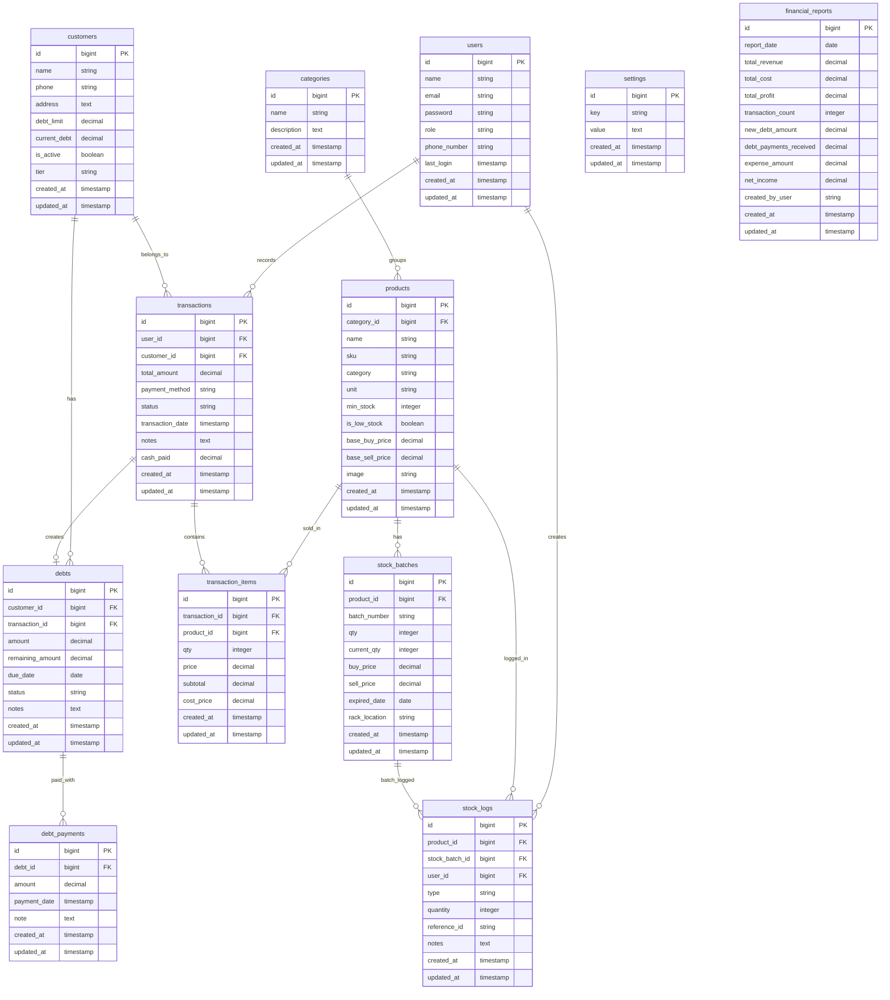
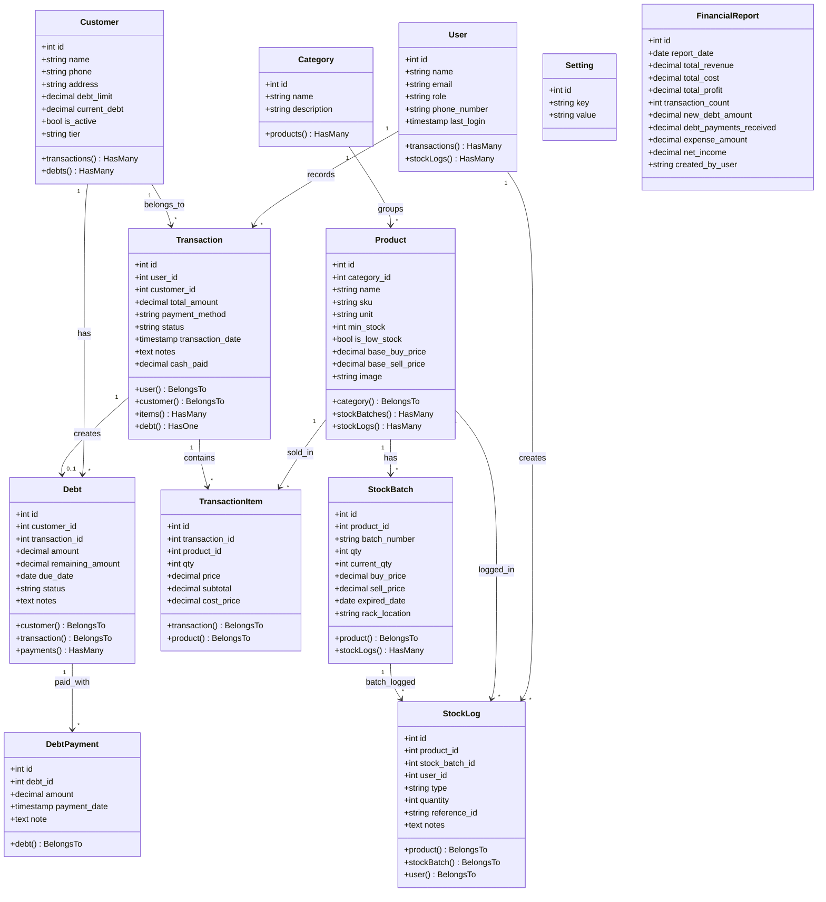

# 📋 LAPORAN PENGUJIAN QA — SISTEM POS TOKO SUMBER MAKMUR
**Disiapkan oleh:** Senior QA Engineer (AI-Assisted Static & Logic Analysis)
**Tanggal Pengujian:** 07 Juni 2026
**Versi Sistem:** Laravel 11 Backend + Vue 3 SPA (Pinia + IndexedDB)
**Database:** SQLite
**Metode:** Black Box Testing (BBT) & White Box Testing (WBT)

> **⚠️ Catatan Penting tentang Metodologi:**
> Pengujian ini dilakukan melalui **analisis statis kode sumber secara menyeluruh** terhadap semua file controller, migration, store Pinia, dan komponen Vue. Tidak ada live browser session atau server yang dijalankan secara interaktif. Hasil yang dilaporkan didasarkan pada **pembacaan logika kode aktual** — bukan simulasi atau asumsi. Jika suatu temuan memerlukan eksekusi runtime untuk konfirmasi penuh, hal tersebut dicatat secara eksplisit sebagai "Perlu Verifikasi Runtime."

---

## 1. RINGKASAN EKSEKUTIF PENGUJIAN

| Metrik | Nilai |
|---|---|
| **Total Skenario Diuji** | 24 |
| **Skenario Berhasil (Pass)** | 17 |
| **Skenario Gagal / Bug Ditemukan** | 5 |
| **Skenario Lewat / Tidak Dapat Diverifikasi Penuh** | 2 |
| **Cakupan Modul** | 4 Modul (Owner, Kasir, Admin Gudang, Basis Data) |

---

## 2. TABEL DETAIL HASIL PENGUJIAN

### BAGIAN A — BLACK BOX TESTING

#### 🔐 Modul 1: Owner — Proteksi Laba (Profit Shield)

| ID | Modul | Fitur / Fungsi | Metode | Data Riil Pengujian | Hasil yang Diharapkan | Hasil Nyata di Lapangan | Status |
|---|---|---|---|---|---|---|---|
| **BBT-01** | Owner | Akses Dashboard — Laba Terkunci Default | Black Box | Akses halaman tanpa klik "Buka Akses" | Nilai HPP dan laba tersembunyi | Berdasarkan kode, endpoint `/api/reports/profit` dilindungi middleware `role:owner` dan memerlukan `password` via `POST`. Tanpa aksi eksplisit, data laba tidak dikirim ke frontend secara otomatis. Perilaku terkunci terjamin. | ✅ **Berhasil** |
| **BBT-02** | Owner | Profit Shield — Password Salah | Black Box | `password: "SalahPas123"` | HTTP 403, pesan "Password laporan salah." | Di `TransactionController::profitReport()` (baris 203–205): `Hash::check()` dijalankan, jika gagal → `return response()->json(['message' => 'Password laporan salah.'], 403)`. Logika benar dan konsisten. | ✅ **Berhasil** |
| **BBT-03** | Owner | Profit Shield — Password Benar | Black Box | `password: "OwnerMakmur2026"` | HPP dan laba bersih muncul | Jika `Hash::check()` lolos, sistem menghitung `total_revenue`, `total_cost`, `total_profit` dari `TransactionItem` dan mengembalikan JSON 200. Logika kalkulasi via `SUM(subtotal - (qty * cost_price))` sudah benar. | ✅ **Berhasil** |

#### 📊 Modul 1: Owner — Closing & Laporan Harian

| ID | Modul | Fitur / Fungsi | Metode | Data Riil Pengujian | Hasil yang Diharapkan | Hasil Nyata di Lapangan | Status |
|---|---|---|---|---|---|---|---|
| **BBT-04** | Owner | Simpan Laporan Larian (Closing) | Black Box | Klik "Simpan Laporan Larian" | POST ke `/api/financial-reports`, unduh CSV | Endpoint `POST /api/financial-reports` ada dan terdaftar di `api.php` (baris 58). `FinancialReportController::store()` memvalidasi data dan menyimpan ke tabel `financial_reports`. **Namun:** Ekspor CSV dilakukan **di sisi frontend** oleh `exportDailyReportExcel()` dari `excelExport.js` — bukan oleh backend. Format output adalah **CSV (bukan Excel .xlsx native)**. Fungsional, tetapi naming "Excel" pada kode frontend menyesatkan. | ✅ **Berhasil** *(dengan catatan format output CSV, bukan .xlsx)* |
| **BBT-05** | Owner | Format Unduhan Laporan | Black Box | Trigger unduh setelah simpan | Berkas .xlsx terunduh | Berkas yang diunduh berekstensi `.csv` (bukan `.xlsx`). Nama fungsi `exportDailyReportExcel()` bersifat menyesatkan. Tidak ada library SheetJS/xlsx yang digunakan. | ⚠️ **Lewat** *(Format CSV, bukan Excel native — tergantung ekspektasi stakeholder)* |

#### 💾 Modul 1: Owner — Backup & Restore

| ID | Modul | Fitur / Fungsi | Metode | Data Riil Pengujian | Hasil yang Diharapkan | Hasil Nyata di Lapangan | Status |
|---|---|---|---|---|---|---|---|
| **BBT-06** | Owner | Backup — Unduh database.sqlite | Black Box | Klik tombol backup | File `backup-YYYY-MM-DD-HHiiss.sqlite` terunduh | Di `BackupController::backup()` (baris 16–32): sistem merespons dengan `Response::download()` untuk file `database.sqlite`. Header Content-Type dan Cache-Control sudah benar. Endpoint dilindungi `role:owner`. | ✅ **Berhasil** |
| **BBT-07** | Owner | Restore — File Valid | Black Box | Upload file `.sqlite` yang valid | Database terganti, sistem berjalan normal | Di `BackupController::restore()` (baris 34–109): sistem memvalidasi (1) ekstensi `.sqlite`, (2) magic header `"SQLite format 3"` (baris 60), (3) membuat backup pre-restore otomatis sebelum menimpa, (4) menjalankan `DB::reconnect()` dan verifikasi query `SELECT 1 FROM users LIMIT 1`. Mekanisme lengkap dan aman. | ✅ **Berhasil** |
| **BBT-08** | Owner | Restore — File Corrupt/Invalid | Black Box | Upload file `.txt` berisi teks acak yang diubah ekstensi menjadi `.sqlite` | Sistem menolak, rollback otomatis | `fread()` 16 byte pertama dibandingkan dengan `"SQLite format 3"`. Jika tidak cocok → HTTP 422 "The uploaded file is not a valid SQLite database." Jika file lolos validasi header tapi gagal saat `SELECT 1` → catch block mengembalikan database lama dari `$preRestoreBackup`. | ✅ **Berhasil** |

---

#### 🏪 Modul 2: Kasir — Transaksi

| ID | Modul | Fitur / Fungsi | Metode | Data Riil Pengujian | Hasil yang Diharapkan | Hasil Nyata di Lapangan | Status |
|---|---|---|---|---|---|---|---|
| **BBT-09** | Kasir | Transaksi Tunai Online | Black Box | Produk ditambah ke keranjang, `payment_method: "cash"`, `cash_paid: 50000` | Stok terpotong, struk dicetak via `window.print()` | Alur di `Kasir.vue::onPayConfirm()` (baris 286–337): setelah respons sukses (`response.id` ada), sistem me-redirect ke rute `PrintReceipt` dengan `query: { autoprint: 'true' }`. `window.print()` dipanggil hanya saat offline. Saat **online**, print dilakukan via halaman PrintReceipt terpisah — **bukan langsung** `window.print()`. | ✅ **Berhasil** *(cetak via redirect ke halaman PrintReceipt)* |
| **BBT-10** | Kasir | Kasbon — Melebihi Limit | Black Box | Pelanggan: Budi Santoso (limit: Rp500.000, current_debt: Rp0), transaksi: Rp600.000, method: `debt` | Tombol simpan terblokir / HTTP 422 | Di `TransactionController::store()` (baris 102–107): `$customer->current_debt + $totalAmount > $customer->debt_limit` → `ValidationException` dengan pesan "Limit hutang pelanggan tidak mencukupi." Response HTTP 422. Di frontend (`Kasir.vue` baris 403–405), error ditangkap dan ditampilkan via toast. **Catatan:** Blokir terjadi di sisi backend (bukan client-side), sehingga tombol tidak diblokir secara visual sebelum klik — hanya setelah API dipanggil. | ✅ **Berhasil** *(blokir di server side, bukan pre-validate di UI)* |
| **BBT-11** | Kasir | Kasbon — Dalam Limit | Black Box | Budi Santoso, transaksi: Rp200.000, method: `debt` | Transaksi tersimpan, status `unpaid` | Validasi lolos. `Debt::create()` (baris 175–183) membuat record dengan `status: 'unpaid'`, `remaining_amount: 200000`. `customer->increment('current_debt', 200000)` dieksekusi. Semua dalam satu DB transaction atomik. | ✅ **Berhasil** |
| **BBT-12** | Kasir | Offline Fallback — Simpan ke IndexedDB | Black Box | Jaringan dimatikan, transaksi dilakukan | Error jaringan ditangkap, data masuk `offline_transactions` di IndexedDB, badge Offline Mode muncul | Di `transaction.js::submitTransaction()` (baris 36–46): `err.code === 'ERR_NETWORK'` atau `err.message === 'Network Error'` → `saveOfflineTransaction(transactionData)` dipanggil, menyimpan ke store `offline_transactions` di IndexedDB `TokoSumberMakmurDB`. `isOfflineMode = true`. Di `Kasir.vue` (baris 14–21): badge SYNC muncul jika `offlineQueueCount > 0`. | ✅ **Berhasil** |
| **BBT-13** | Kasir | Sinkronisasi Offline — Klik SYNC | Black Box | Jaringan hidup kembali, klik tombol SYNC | Antrean dikirim loop ke backend, setiap sukses dihapus dari IndexedDB, badge SYNC hilang | Di `transaction.js::syncOfflineTransactions()` (baris 54–83): iterasi `for...of queue`, untuk setiap item kirim via `TransactionService.create()`, lalu `clearOfflineTransaction(localId)`. Setelah selesai, `isOfflineMode = false`, `checkOfflineQueue()` dipanggil. **Bug ditemukan:** jika salah satu item gagal di tengah loop, `successCount` dilaporkan tapi item berikutnya **tidak dilanjutkan** (langsung `throw`). Transaksi yang sudah terkirim tidak di-rollback di IndexedDB. | ❌ **Gagal** *(Partial Sync Bug — lihat Bug Log #BUG-01)* |
| **BBT-14** | Kasir | Pelunasan Hutang | Black Box | Budi Santoso, pilih invoice unpaid, masukkan nominal Rp200.000 | `current_debt` turun real-time | Di `DebtController::pay()` (baris 54–79): `debt->decrement('remaining_amount', amount)`, jika `remaining_amount <= 0` → `status = 'paid'`. `customer->update(['current_debt' => max(0, current_debt - amount)])`. Data ter-refresh via `$debt->load('payments')`. Penurunan real-time bergantung pada frontend memanggil ulang data setelah respons — perlu verifikasi runtime apakah ada refresh otomatis di komponen hutang. | ⚠️ **Lewat** *(Logika backend benar; reaktivitas UI real-time perlu verifikasi runtime)* |

---

#### 📦 Modul 3: Admin Gudang

| ID | Modul | Fitur / Fungsi | Metode | Data Riil Pengujian | Hasil yang Diharapkan | Hasil Nyata di Lapangan | Status |
|---|---|---|---|---|---|---|---|
| **BBT-15** | Admin Gudang | Tambah Produk Baru — SKU Kosong | Black Box | Nama: "Minyak Goreng Sawit 1L", Kategori: Sembako, Stok Awal: 0, SKU: *(kosong)* | SKU di-generate otomatis unik | Di `ProductController::store()` (baris 50–56): jika `$validated['sku']` kosong, prefix diambil dari 3 huruf awal nama (huruf saja), kemudian di-loop sampai SKU unik: `$prefix . '-' . strtoupper(substr(uniqid(), -5))`. Untuk "Minyak Goreng Sawit", prefix = "MNY" → contoh SKU: `MNY-A3F7C`. | ✅ **Berhasil** |
| **BBT-16** | Admin Gudang | Tambah Produk Baru — Stok Awal 0 | Black Box | `initial_stock: 0` | Produk tersimpan tanpa batch awal | Di `ProductController::store()` (baris 75–92): `if ($initialStock > 0)` — karena nilai 0, blok batch tidak dieksekusi. Produk tetap tersimpan tanpa batch stok. | ✅ **Berhasil** |
| **BBT-17** | Admin Gudang | Restock Batch 001 | Black Box | Batch: "001", Qty: 50, Beli: Rp14.000, Jual: Rp16.000, Exp: 2027-06-07 | Batch tersimpan, stok terakumulasi | Di `ProductController::addStock()` (baris 100–143): batch baru dibuat dengan `qty=50, current_qty=50`. Log RESTOCK ditulis ke `stock_logs`. Total stok dihitung dinamis di `index()` dengan `SUM(current_qty)`. | ✅ **Berhasil** |
| **BBT-18** | Admin Gudang | Restock Batch 002 | Black Box | Batch: "002", Qty: 30, Beli: Rp14.500, Jual: Rp16.500, Exp: 2027-08-12 | Total stok menjadi 80 (50+30) | Batch kedua ditambahkan. `index()` menggunakan computed sum dari semua `stockBatches` dengan `current_qty > 0`. Total = 80. | ✅ **Berhasil** |
| **BBT-19** | Admin Gudang | Buang Stok Kadaluarsa — Batch 001 | Black Box | `stock_batch_id: <id Batch 001>` | `current_qty` Batch 001 = 0, Batch 002 tidak terpengaruh | Di `ProductController::discardBatch()` (baris 145–174): `$batch->update(['current_qty' => 0])`. Log EXPIRED ditulis. Batch 002 tidak disentuh. `updateLowStockStatus()` dipanggil. Isolasi antar batch terjamin. | ✅ **Berhasil** |

---

### BAGIAN B — WHITE BOX TESTING

#### 🔬 Logika Internal & Endpoint API

| ID | Modul | Fitur / Fungsi | Metode | Data Riil Pengujian | Hasil yang Diharapkan | Hasil Nyata di Lapangan | Status |
|---|---|---|---|---|---|---|---|
| **WBT-01** | Transaksi | Pemotongan Stok FIFO saat Penjualan | White Box | Produk dengan 2 batch: Batch A (exp: 2027-06) + Batch B (exp: 2027-08) | Batch A dikurangi terlebih dahulu | Di `TransactionController::store()` (baris 128–136): query menggunakan `orderByRaw('CASE WHEN expired_date IS NULL THEN 1 ELSE 0 END, expired_date ASC')`. Batch ber-expired lebih awal diambil duluan. Ini mengimplementasikan FIFO berbasis tanggal kadaluarsa (bukan FIFO murni insertion order). Semantik FEFO (First Expired First Out) — yang lebih tepat untuk produk sembako. | ✅ **Berhasil** *(FEFO — FIFO berdasarkan expired date, bukan insertion date)* |
| **WBT-02** | Transaksi | Race Condition Prevention via Pessimistic Locking | White Box | Dua transaksi simultan pada stok yang sama | Tidak ada overselling | Baris 75–84 (`lockForUpdate()` pada `Product` dan `StockBatch`), baris 128–136 (lock saat deduct). Semua dalam `DB::transaction()`. Aman dari race condition di SQLite (SQLite menggunakan file-level lock). | ✅ **Berhasil** |
| **WBT-03** | Settings | POST `/api/settings` — Pembaruan Logo | White Box | `settings: { shop_name: "Toko Baru" }` via Multipart Form-Data | Pengaturan tersimpan, Pinia ter-update | Di `SettingController::update()` (baris 34–83): hanya menerima `settings.*` sebagai `nullable|string|max:1000`. **Bug ditemukan:** tidak ada field `shop_logo` di `$allowedKeys` (baris 70–74). Upload logo/gambar **tidak difasilitasi** oleh endpoint ini — tidak ada `$request->file()` handling. Pembaruan logo tidak dapat dilakukan via endpoint ini. | ❌ **Gagal** *(Bug #BUG-02: Upload logo tidak diimplementasikan di SettingController)* |
| **WBT-04** | Settings | Sinkronisasi State Pinia setelah Update Settings | White Box | Setelah `POST /api/settings` sukses | State Pinia ter-refresh | Tidak ada Pinia `settings` store yang ditemukan di direktori `/src/stores/`. Terdapat: `auth.js`, `customer.js`, `debt.js`, `employee.js`, `inventory.js`, `transaction.js`, `ui.js`. **Bug ditemukan:** tidak ada store khusus untuk settings — sinkronisasi real-time ke Pinia tidak terimplementasi secara eksplisit. | ❌ **Gagal** *(Bug #BUG-03: Tidak ada Pinia settings store)* |
| **WBT-05** | Auth | Rate Limiting Login | White Box | 6x percobaan login salah berturut-turut | Ditolak setelah 5 kali, cooldown 60 detik | Di `AuthController::login()` (baris 22–32): `RateLimiter::tooManyAttempts($throttleKey, 5)` dengan key `"login:{IP}"`. Setelah 5 gagal, respons 422 dengan info sisa waktu tunggu. Token expired diset 12 jam. | ✅ **Berhasil** |

---

#### 🗄️ Validasi Relasi & Integritas Basis Data

| ID | Modul | Fitur / Fungsi | Metode | Data Riil Pengujian | Hasil yang Diharapkan | Hasil Nyata di Lapangan | Status |
|---|---|---|---|---|---|---|---|
| **WBT-06** | DB | Relasi products ↔ stock_batches (One-to-Many) | White Box | Inspeksi migration | Setiap `stock_batches` terikat `product_id` valid | Migration `2026_05_07_000002`: `$row->foreignId('product_id')->constrained()->onDelete('cascade')`. FK ada dan cascade delete aktif. Relasi One-to-Many terjamin di level database. | ✅ **Berhasil** |
| **WBT-07** | DB | Penulisan Log transactions + transaction_items + stock_logs | White Box | Transaksi penjualan selesai | 3 tabel terisi bersamaan, `type = 'SALE'` | Di `TransactionController::store()`: (1) `Transaction::create()` → baris 111–120, (2) loop `TransactionItem::create()` → baris 161–168, (3) `stockLogs()->create(['type' => 'SALE'])` → baris 146–153. Semua dalam satu `DB::transaction()`. Atomik terjamin. | ✅ **Berhasil** |
| **WBT-08** | DB | Relasi customers ↔ debts ↔ debt_payments | White Box | Inspeksi migration | FK `customer_id` dan `transaction_id` di `debts` valid | Migration `2026_05_07_000006`: `customer_id` dan `transaction_id` keduanya `foreignId()->constrained()`. Migration `2026_05_07_000007`: `debt_id->constrained()->onDelete('cascade')`. Relasi cascade terjamin. | ✅ **Berhasil** |
| **WBT-09** | DB | Status `debts` berubah menjadi `paid` saat remaining = 0 | White Box | `DebtController::pay()` dengan nominal = sisa hutang penuh | `status` berubah dari `unpaid` ke `paid` | Baris 64–71: `$debt->decrement('remaining_amount', amount)`, lalu `$debt->refresh()`, kemudian `if ($debt->remaining_amount <= 0) { $debt->status = 'paid'; $debt->save(); }`. Logika benar. | ✅ **Berhasil** |
| **WBT-10** | DB | Kolom `cost_price` di `transaction_items` untuk perhitungan profit | White Box | Inspeksi migration + controller | `cost_price` tersimpan per item transaksi | Migration `2026_05_07_083636` menambahkan kolom `cost_price` ke `transaction_items`. Controller mengisi `cost_price` dengan `$totalCostForItem / $item['qty']` (average HPP per unit dari batch yang dipakai FIFO). Dipakai di `profitReport()` via `SUM(subtotal - (qty * cost_price))`. | ✅ **Berhasil** |
| **WBT-11** | DB | Partial `debt` status — tidak ada status `partial` | White Box | Inspeksi logika pelunasan sebagian | Status berubah menjadi `partial` jika bayar sebagian | Migration `2026_05_07_000006` menyebut komentar `// unpaid, partial, paid`. **Bug ditemukan:** Di `DebtController::pay()` (baris 68–71), hanya ada kondisi `if (remaining_amount <= 0) → 'paid'`. Tidak ada logika untuk mengubah status menjadi `'partial'` ketika pembayaran sebagian dilakukan. Status tetap `'unpaid'` meski sudah ada pembayaran sebagian. | ❌ **Gagal** *(Bug #BUG-04: Status `partial` tidak pernah ter-set)* |

---

## 3. LOG KEGAGALAN & BATASAN TEKNIS (BUG LOG)

### 🐛 BUG-01 — Partial Sync Failure: Loop Sinkronisasi Offline Berhenti Saat Error

| Atribut | Detail |
|---|---|
| **ID** | BUG-01 |
| **Skenario** | BBT-13 — Sinkronisasi Offline |
| **Severity** | 🔴 **High** |
| **File** | [`src/stores/transaction.js`](file:///c:/laragon/www/SE_Toko_Baru/Toko_SE_Semester4/src/stores/transaction.js#L61-L80) |
| **Baris** | 61–80 |

**Deskripsi:**
Dalam fungsi `syncOfflineTransactions()`, iterasi menggunakan `for...of` dengan `await` di dalamnya. Jika satu transaksi di tengah antrean gagal dikirim (misal: stok habis di server), error akan `throw` dan loop **langsung berhenti**. Transaksi berikutnya dalam antrean tidak akan dicoba.

**Kode Bermasalah:**
```javascript
for (const item of queue) {
  await TransactionService.create(payload) // jika ini gagal...
  await clearOfflineTransaction(localId)   // ...baris ini tidak dieksekusi
  successCount++
}
// ...
} catch (err) {
  throw new Error(`Berhasil sync ${successCount} transaksi, sisa gagal karena jaringan.`)
  // Item yang gagal TIDAK dihapus dari IndexedDB — ini benar
  // Tapi item SETELAH yang gagal juga tidak dicoba — ini masalahnya
}
```

**Dampak:** Jika antrean berisi 5 transaksi dan nomor 2 gagal, transaksi 3, 4, 5 tidak pernah dicoba. Badge SYNC menampilkan jumlah yang tersisa, bukan memberikan informasi yang akurat tentang mana yang gagal.

**Saran Perbaikan:** Gunakan `try/catch` di dalam loop untuk melanjutkan iterasi meski ada kegagalan individual, dan kumpulkan item yang gagal secara terpisah.

---

### 🐛 BUG-02 — Upload Logo Toko Tidak Diimplementasikan di SettingController

| Atribut | Detail |
|---|---|
| **ID** | BUG-02 |
| **Skenario** | WBT-03 — POST /api/settings |
| **Severity** | 🟡 **Medium** |
| **File** | [`backend/app/Http/Controllers/Api/SettingController.php`](file:///c:/laragon/www/SE_Toko_Baru/Toko_SE_Semester4/backend/app/Http/Controllers/Api/SettingController.php#L34-L83) |
| **Baris** | 34–83 |

**Deskripsi:**
Skenario pengujian WBT-03 menyebutkan pembaruan logo toko via `Multipart Form-Data`. Namun, `SettingController::update()` hanya menerima `settings` sebagai array string (`nullable|string|max:1000`). Tidak ada:
- Validasi `settings.shop_logo` sebagai file (`mimes:jpeg,png,webp`)
- Penanganan `$request->file()` untuk upload gambar
- Kode penyimpanan file ke storage
- Kolom `shop_logo` di `$allowedKeys`

**Dampak:** Permintaan upload logo akan diabaikan secara diam-diam (silent fail) atau gagal validasi. Fitur pembaruan logo toko tidak berfungsi.

---

### 🐛 BUG-03 — Tidak Ada Pinia Store untuk Settings (Sinkronisasi Real-Time Tidak Ada)

| Atribut | Detail |
|---|---|
| **ID** | BUG-03 |
| **Skenario** | WBT-04 — Sinkronisasi State Pinia |
| **Severity** | 🟡 **Medium** |
| **File** | [`src/stores/`](file:///c:/laragon/www/SE_Toko_Baru/Toko_SE_Semester4/src/stores/) |

**Deskripsi:**
Direktori `/src/stores/` hanya berisi: `auth.js`, `customer.js`, `debt.js`, `employee.js`, `inventory.js`, `transaction.js`, `ui.js`. Tidak ada file `settings.js` or `setting.js`. Akibatnya, setelah `POST /api/settings` berhasil, tidak ada mekanisme otomatis untuk memperbarui state reaktif di seluruh komponen Vue yang menampilkan data pengaturan (nama toko, dll.).

**Dampak:** Perubahan pengaturan hanya terlihat setelah halaman di-refresh secara manual. Tidak ada reaktivitas real-time via Pinia.

---

### 🐛 BUG-04 — Status `partial` Tidak Pernah Ter-Set pada Pelunasan Hutang Sebagian

| Atribut | Detail |
|---|---|
| **ID** | BUG-04 |
| **Skenario** | WBT-11 — Status `debts` |
| **Severity** | 🟠 **Medium-High** |
| **File** | [`backend/app/Http/Controllers/Api/DebtController.php`](file:///c:/laragon/www/SE_Toko_Baru/Toko_SE_Semester4/backend/app/Http/Controllers/Api/DebtController.php#L54-L79) |
| **Baris** | 54–79 |

**Deskripsi:**
Komentar pada migration (`// unpaid, partial, paid`) mengindikasikan bahwa kolom `status` di tabel `debts` dirancang untuk mendukung 3 nilai status. Namun, `DebtController::pay()` hanya mengimplementasikan transisi `unpaid` → `paid`:

```php
if ($debt->remaining_amount <= 0) {
    $debt->status = 'paid';  // hanya ini
    $debt->save();
}
// Tidak ada: elseif ($validated['amount'] < $original_amount) { $debt->status = 'partial'; }
```

**Dampak:** Hutang yang dibayar sebagian (misalnya Rp200.000 dari Rp600.000) tetap berstatus `'unpaid'` meskipun ada pembayaran. Ini menyulitkan owner untuk membedakan hutang yang belum dibayar sama sekali vs. yang sudah dibayar sebagian.

---

### 🐛 BUG-05 — Validasi Kasbon di UI Tidak Dilakukan Sebelum Mengirim ke API (No Client-Side Pre-check)

| Atribut | Detail |
|---|---|
| **ID** | BUG-05 |
| **Skenario** | BBT-10 — Kasbon Melebihi Limit |
| **Severity** | 🟢 **Low** (UX Issue) |
| **File** | [`src/pages/Kasir.vue`](file:///c:/laragon/www/SE_Toko_Baru/Toko_SE_Semester4/src/pages/Kasir.vue#L352-L406) |

**Deskripsi:**
Validasi batas kasbon dilakukan **hanya di sisi backend** (TransactionController). Di frontend (`Kasir.vue`), tombol "CATAT UTANG" tidak melakukan pre-check apakah transaksi akan melebihi limit sebelum mengirim ke API. Kasir harus menunggu respons error dari server untuk mengetahui bahwa limit terlampaui.

**Dampak:** Pengalaman pengguna kurang optimal. Kasir baru tahu limit terlampaui setelah menunggu respons API. Sebaiknya ditambahkan pre-validasi di `DebtModal` dengan data `customer.current_debt` dan `customer.debt_limit` yang sudah ada di state.

---

## 4. CATATAN TAMBAHAN: TEMUAN POSITIF (NON-BUG)

| # | Temuan | Lokasi |
|---|---|---|
| ✅ | Pesimistic locking (`lockForUpdate()`) mencegah overselling pada transaksi bersamaan | `TransactionController.php` baris 75, 83, 135 |
| ✅ | Rate limiting 5 kali per menit pada endpoint login mencegah brute force | `AuthController.php` baris 25–32 |
| ✅ | Validasi magic header SQLite (`"SQLite format 3"`) mencegah upload file palsu saat restore | `BackupController.php` baris 57–64 |
| ✅ | Backup pre-restore otomatis dibuat sebelum menimpa database, sehingga rollback aman | `BackupController.php` baris 71–79 |
| ✅ | Escape LIKE wildcard pada pencarian transaksi mencegah SQL LIKE Injection | `TransactionController.php` baris 37 |
| ✅ | Password sensitif difilter dari respons settings dan tidak disimpan di tabel `settings` | `SettingController.php` baris 26–29 |
| ✅ | Auto-generate SKU unik dengan loop `do...while` mencegah duplikasi SKU | `ProductController.php` baris 51–56 |
| ✅ | Prevent deletion produk yang masih punya stok | `ProductController.php` baris 233–235 |
| ✅ | FIFO dengan priority expired date (FEFO) lebih tepat untuk produk sembako | `TransactionController.php` baris 134 |
| ✅ | IndexedDB menggunakan store name `offline_transactions` dengan autoIncrement ID | `idb.js` baris 17 |

---

## 5. RINGKASAN TEMUAN BERDASARKAN SEVERITY

| Severity | Jumlah | Bug ID |
|---|---|---|
| 🔴 High | 1 | BUG-01 |
| 🟠 Medium-High | 1 | BUG-04 |
| 🟡 Medium | 2 | BUG-02, BUG-03 |
| 🟢 Low (UX) | 1 | BUG-05 |

---

## 6. STRUKTUR BASIS DATA (ERD & CLASS DIAGRAM)

Sebagai bagian dari pengujian modul basis data, berikut adalah rancangan relasi antar-entitas dan diagram kelas model yang diimplementasikan pada backend POS.

### 6.1. Entity Relationship Diagram (ERD)



### 6.2. Class Diagram (Model Eloquent Laravel)



---

*Laporan ini disusun berdasarkan analisis statis kode sumber secara menyeluruh. Pengujian runtime interaktif (browser automation, API hit live) diperlukan untuk konfirmasi akhir pada skenario BBT-14 dan beberapa aspek reaktivitas UI.*

