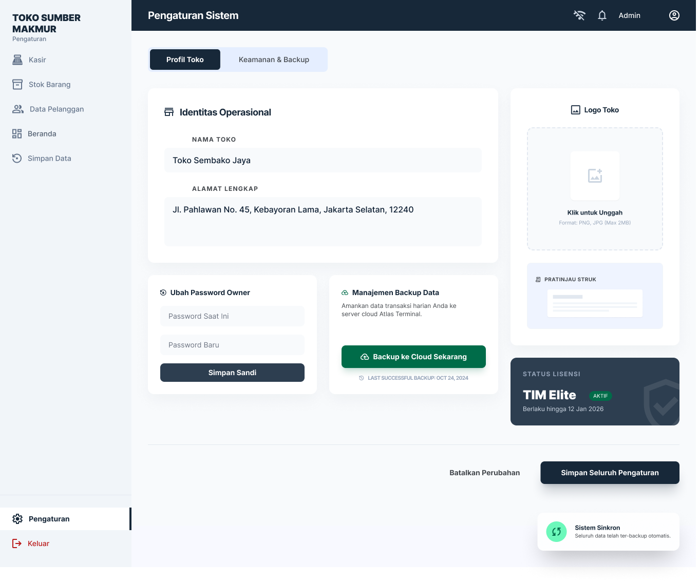
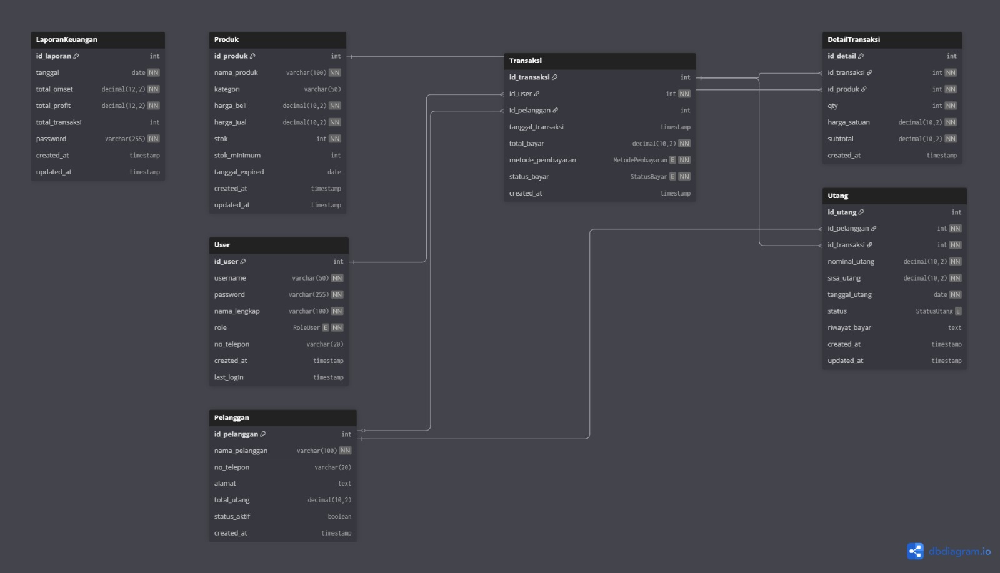
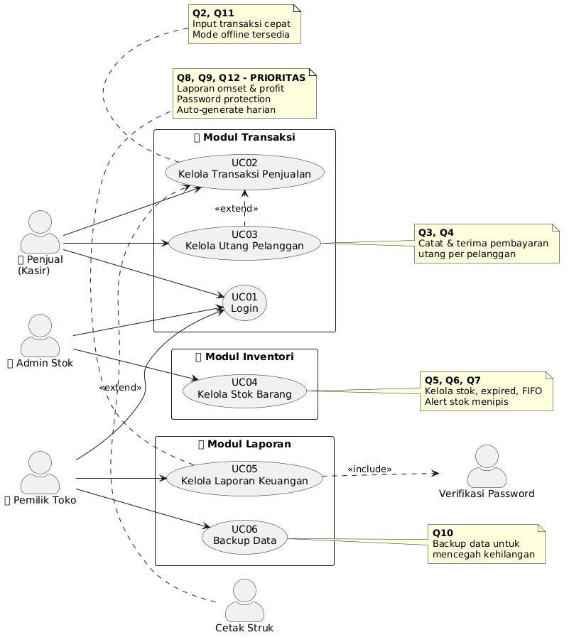
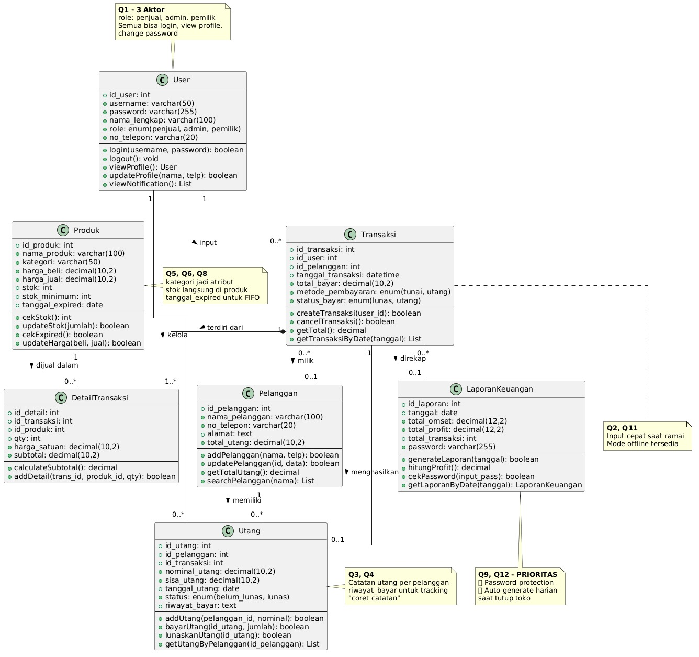
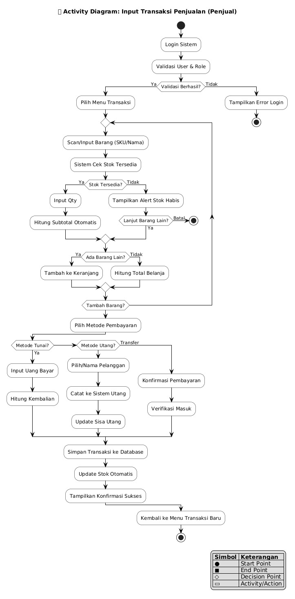
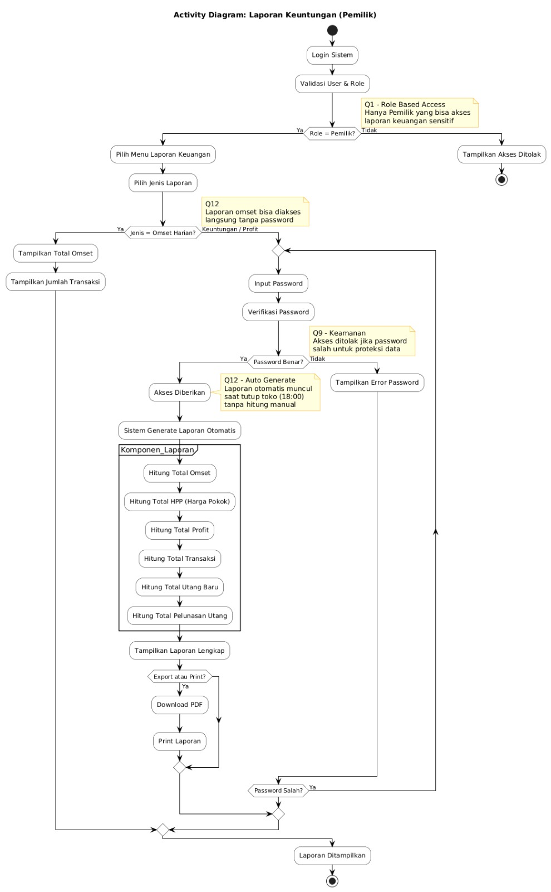
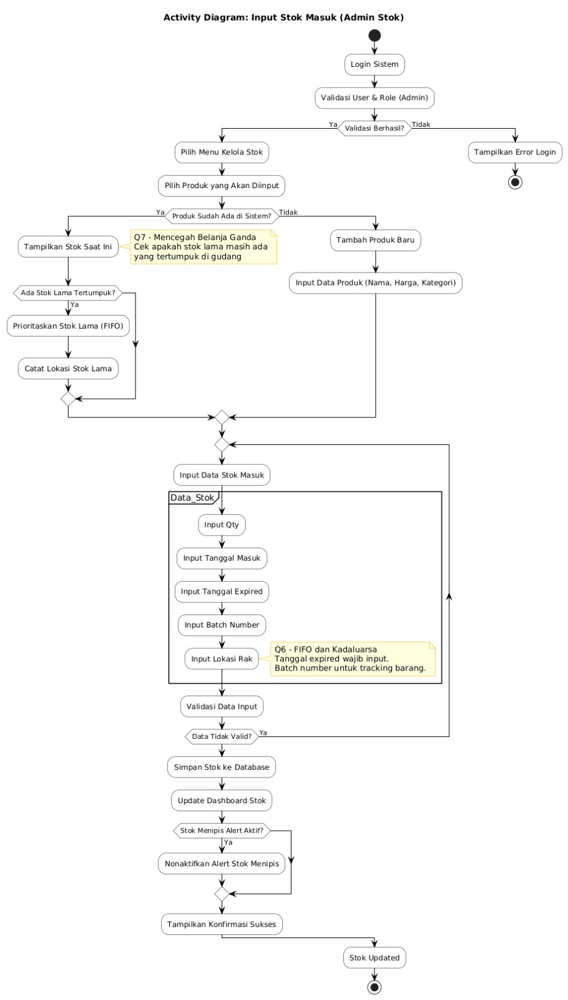
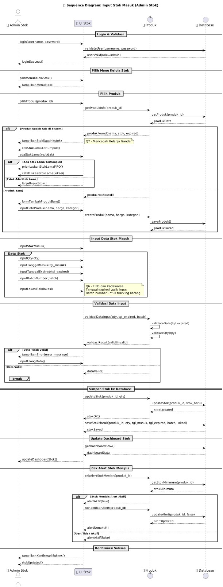
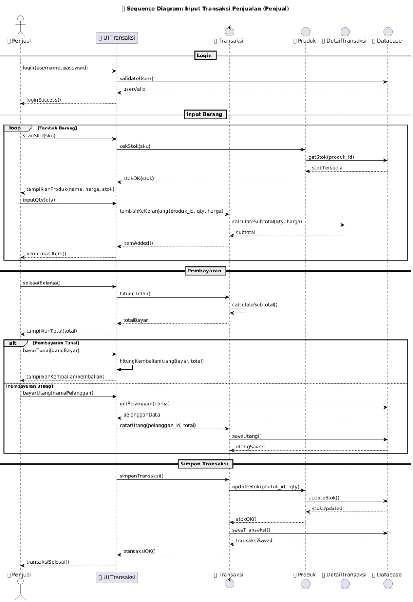
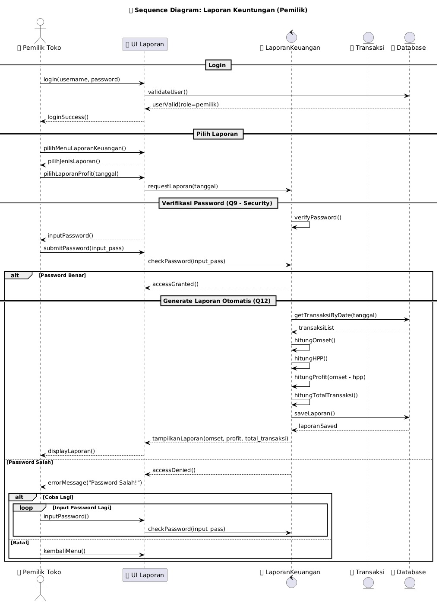

# 🛒 Toko Sumber Makmur POS (Point of Sale)

[](https://vuejs.org/)
[](https://laravel.com/)
[](https://www.sqlite.org/)
[](https://github.com/)

Sistem kasir (Point of Sale) desktop-optimized modern berbasis **Single Page Application (SPA)** untuk toko sembako. Mengintegrasikan **Vue 3** (Composition API + Pinia) sebagai Frontend dengan **Laravel 11** REST API dan database portabel **SQLite** sebagai Backend.

---

## 📋 Daftar Isi

- [Arsitektur Teknologi](#-arsitektur-teknologi)
- [Fitur Utama](#-fitur-utama)
- [Panduan Instalasi](#-panduan-instalasi)
- [Kredensial Pengujian](#-kredensial-akun-pengujian)
- [Struktur Repositori](#-struktur-repositori)
- [Database Schema](#-database-schema)
- [API Endpoints](#-api-endpoints)
- [Panduan Penggunaan](#-panduan-penggunaan)
- [Troubleshooting](#-troubleshooting)

---

## 🛠️ Arsitektur Teknologi

| Layer | Teknologi | Fungsi |
|---|---|---|
| **Frontend** | Vue 3 (Composition API) + Vite | SPA dengan dev server port 5173 |
| **State Management** | Pinia (7 stores) | Manajemen state: auth, inventory, cart, dll. |
| **Styling** | Vanilla CSS | CSS Custom Properties, Flexbox, Grid |
| **HTTP Client** | Axios | Interceptor token + base URL config |
| **Offline Storage** | IndexedDB | Antrean transaksi offline via `idb.js` |
| **Backend** | Laravel 11 | REST API dengan autentikasi Sanctum |
| **Database** | SQLite | Zero-configuration, portable |
| **ORM** | Eloquent | 14 model dengan relasi kompleks |

---
## ✨ Fitur Utama

### 1. Dashboard Owner
- Statistik real-time: Total Omset, Jumlah Transaksi, Margin Keuntungan
- **Profit Shield**: HPP & Laba Bersih dilindungi password owner
- Grafik tren penjualan 8 bulan
- Sistem notifikasi stok kritis & barang kedaluwarsa

<details>
  <summary>📸 Lihat Screenshot Dashboard Owner</summary>
  <br>
  
</details>

### 2. Kasir / POS
- Pencarian produk kilat (nama, kategori, barcode)
- Input kuantitas langsung via keyboard
- Metode pembayaran: **Tunai** (kembalian otomatis + struk thermal) dan **Kasbon** (validasi limit kredit)
- **Offline Queue**: Transaksi tetap tersimpan di IndexedDB saat internet putus, SYNC satu tombol

<details>
  <summary>📸 Lihat Screenshot Kasir & Pembayaran</summary>
  <br>
  
</details>

### 3. Manajemen Stok FIFO
- Batch stok berdasarkan tanggal masuk & kedaluwarsa
- Penjualan otomatis potong stok batch tertua (FIFO)
- Indikator visual: stok aman (hijau), menipis (kuning), habis (merah)
- Riwayat pergerakan stok (RESTOCK, SALE, RETURN)

<details>
  <summary>📸 Lihat Screenshot Manajemen Stok</summary>
  <br>
  
</details>

### 4. Manajemen Pelanggan & Kasbon (Hutang)
- Pencatatan data pelanggan dengan tier
- Batas limit kredit (debt_limit) per pelanggan
- Pelunasan hutang dengan tracking pembayaran

<details>
  <summary>📸 Lihat Screenshot Manajemen Pelanggan</summary>
  <br>
  
</details>

### 5. RBAC (Role-Based Access Control)
- **Owner**: Akses penuh ke seluruh sistem
- **Admin Gudang**: Stok Barang saja
- **Kasir**: POS Kasir & Pelanggan saja

<details>
  <summary>📸 Lihat Screenshot Pilihan Role & Login</summary>
  <br>
  
</details>

### 6. Retur Transaksi
- Pencarian transaksi untuk retur
- Auto-approve retur dengan pengembalian stok otomatis
- Batch retur dengan prefix `RET-`

### 7. Laporan Keuangan
- Filter tanggal, metode pembayaran, search ID transaksi
- Export CSV/Excel dengan UTF-8 BOM (kompatibel Excel Indonesia)
- Paginasi 15 item per halaman

<details>
  <summary>📸 Lihat Screenshot Laporan Keuangan</summary>
  <br>
  
</details>

### 8. Pengaturan Sistem & Database Backup
- Nama toko, alamat, telepon (sinkron real-time ke sidebar)
- Upload logo toko
- Backup & restore database

<details>
  <summary>📸 Lihat Screenshot Pengaturan & Backup</summary>
  <br>
  
  <br><br>
  
</details>

---

## 🚀 Panduan Instalasi

### Prasyarat
- PHP >= 8.2 (Laragon / XAMPP)
- Composer
- Node.js >= 18 (dengan NPM)
- Git (opsional)

### 1. Backend (Laravel API)

```bash
cd backend

# Install dependencies
composer install

# Setup environment
cp .env.example .env
php artisan key:generate

# Create SQLite database
# Windows PowerShell:
New-Item -ItemType File -Path database/database.sqlite -Force
# Linux/Mac:
# touch database/database.sqlite

# Run migrations + seed data
php artisan migrate:fresh --seed

# Start server (port 8000)
php artisan serve
```

### 2. Frontend (Vue 3 SPA)

```bash
# Return to project root
cd ..

# Install dependencies
npm install

# Start dev server (port 5173)
npm run dev
```

### 3. Buka Browser

```
http://localhost:5173
```

---

## 🔑 Kredensial Akun Pengujian

| Role | Username | Password | Akses |
|---|---|---|---|
| **Owner** | `owner` | `password123` | Seluruh menu (9 halaman) |
| **Admin Gudang** | `admin` | `password123` | Stok Barang |
| **Kasir** | `kasir1` | `password123` | Kasir & Pelanggan |

> **Tip**: Password untuk membuka data laba bersih di Dashboard = `password123`

---

## 📂 Struktur Repositori

```
Toko_SE_Semester4/
├── src/                          # Vue 3 Frontend
│   ├── pages/                    # 12 halaman route-level
│   │   ├── Login.vue             # /login
│   │   ├── RoleSelection.vue     # /select-role
│   │   ├── Dashboard.vue         # / (owner only)
│   │   ├── Kasir.vue             # /kasir (owner, kasir)
│   │   ├── Inventory.vue         # /inventory (owner, admin)
│   │   ├── Pelanggan.vue         # /pelanggan (owner, kasir)
│   │   ├── LunasHutang.vue       # /pelanggan/:id/bayar
│   │   ├── Laporan.vue           # /laporan (owner only)
│   │   ├── Pengaturan.vue        # /pengaturan (owner only)
│   │   ├── Backup.vue            # /backup (owner only)
│   │   ├── PrintReceipt.vue      # /print-receipt/:id
│   │   └── Karyawan.vue          # /karyawan (owner only)
│   ├── components/
│   │   ├── modals/               # DebtModal, PaymentModal, GantiUserModal
│   │   └── shared/               # NotificationPanel, Toast, ReceiptPrint
│   ├── stores/                   # 7 Pinia stores
│   ├── services/                 # 9 API service wrappers
│   ├── utils/                    # idb.js (IndexedDB), excelExport.js
│   ├── plugins/                  # Axios instance
│   ├── layouts/                  # MainLayout.vue
│   ├── router/                   # Vue Router + Auth Guard
│   ├── App.vue
│   ├── main.js
│   └── style.css                 # CSS Design Tokens
│
├── backend/                      # Laravel 11 Backend
│   ├── app/
│   │   ├── Models/               # 14 Eloquent models
│   │   └── Http/Controllers/Api/ # 14 API controllers
│   ├── database/
│   │   ├── migrations/           # 24 migration files
│   │   ├── seeders/              # 4 seeders
│   │   └── database.sqlite       # SQLite database
│   ├── routes/api.php            # API routes
│   └── .env.example              # Environment template
│
├── package.json                  # Frontend dependencies
├── vite.config.js                # Vite configuration
├── .gitignore                    # Git ignore rules
└── README.md                     # This file
```

---

## 🗄️ Database Schema

### Entity Relationship Diagram (ERD)
Berikut adalah visualisasi hubungan antar entitas database SQLite pada aplikasi:



### Tabel Utama

| Tabel | Fungsi | Relasi |
|---|---|---|
| `users` | Data user/karyawan (3 role) | - |
| `products` | Data produk | hasMany StockBatch, TransactionItem |
| `stock_batches` | Batch stok per produk (FIFO) | belongsTo Product, hasMany StockLog |
| `stock_logs` | Log pergerakan stok | belongsTo StockBatch, User |
| `categories` | Kategori produk | hasMany Product |
| `customers` | Data pelanggan | hasMany Transaction, Debt |
| `transactions` | Transaksi penjualan | belongsTo User/Customer, hasMany TransactionItem |
| `transaction_items` | Item per transaksi | belongsTo Transaction, Product |
| `debts` | Catatan hutang | belongsTo Customer, Transaction |
| `debt_payments` | Pembayaran hutang | belongsTo Debt |
| `settings` | Pengaturan sistem (key-value) | - |
| `financial_reports` | Laporan keuangan harian | - |
| `transaction_returns` | Retur transaksi | belongsTo Transaction, TransactionItem |

---

## 🌐 API Endpoints

### Autentikasi
| Method | Endpoint | Deskripsi |
|---|---|---|
| POST | `/api/login` | Login (username + password + role) |
| POST | `/api/logout` | Logout |
| GET | `/api/me` | Data user aktif |

### Produk
| Method | Endpoint | Deskripsi |
|---|---|---|
| GET | `/api/products` | Daftar produk + batch + stok |
| POST | `/api/products` | Tambah produk |
| PUT | `/api/products/:id` | Edit produk |
| DELETE | `/api/products/:id` | Hapus produk (jika stok=0) |
| POST | `/api/products/:id/stock` | Restock batch baru |
| GET | `/api/products/:id/history` | Riwayat stok |

### Transaksi
| Method | Endpoint | Deskripsi |
|---|---|---|
| GET | `/api/transactions` | Daftar transaksi (filter tanggal/metode) |
| POST | `/api/transactions` | Buat transaksi (FIFO reduction) |
| GET | `/api/transactions/:id` | Detail transaksi |

### Pelanggan & Hutang
| Method | Endpoint | Deskripsi |
|---|---|---|
| GET/POST/PUT/DELETE | `/api/customers` | CRUD pelanggan |
| GET | `/api/debts` | Daftar hutang |
| POST | `/api/debts/:id/pay` | Bayar hutang |

### Laporan
| Method | Endpoint | Deskripsi |
|---|---|---|
| POST | `/api/reports/profit` | Laporan profit (password protected) |
| POST | `/api/reports/detailed` | Detail penjualan |
| GET/POST | `/api/financial-reports` | Laporan keuangan tersimpan |

### Lainnya
| Method | Endpoint | Deskripsi |
|---|---|---|
| GET | `/api/dashboard/stats` | Statistik dashboard |
| GET | `/api/notifications` | Notifikasi (stok, kedaluwarsa, hutang) |
| GET/POST | `/api/settings` | Pengaturan sistem |
| GET | `/api/backup` | Download database |
| POST | `/api/restore` | Restore database |

---

## 📖 Panduan Penggunaan

### Alur Transaksi Kasir
1. Buka `/kasir` → produk ditampilkan per kategori
2. Klik produk → masuk ke keranjang (qty default: 1)
3. Ubah kuantitas langsung di input field
4. Klik **BAYAR** (atau tekan F10) → PaymentModal muncul
5. Pilih metode (Tunai/QRIS/Transfer) → isi nominal → Konfirmasi
6. Struk otomatis ditampilkan untuk dicetak

### Alur Kasbon (Hutang)
1. Klik **CATAT UTANG** di keranjang
2. Ketik nama pelanggan → pilih dari dropdown
3. Sistem cek limit kredit → jika melebihi, tombol disabled
4. Simpan → transaksi tersimpan + catatan hutang dibuat

### Alur Pelunasan Hutang
1. Buka `/pelanggan` → klik ikon bayar
2. Lihat daftar hutang belum lunas
3. Isi jumlah bayar → klik Bayar
4. Sisa hutang berkurang, status berubah jika lunas

### Mode Offline
1. Saat internet putus, transaksi tersimpan ke IndexedDB
2. Tombol **SYNC** (kuning) muncul di header kasir
3. Saat internet pulih, klik SYNC → data terkirim ke server

---

## 📐 Desain Sistem & Diagram UML

Untuk memetakan logika proses dan struktur sistem secara akademis, proyek ini dilengkapi dengan diagram UML berikut:

### Use Case Diagram
Menggambarkan batasan sistem dan interaksi aktor (Owner, Kasir, Admin Gudang) dengan modul-modul POS.


### Class Diagram
Menunjukkan hubungan statis dan struktur kelas model Eloquent yang digunakan pada backend Laravel.


### Activity Diagrams
Mendokumentasikan alur aktivitas dinamis untuk proses-proses bisnis kritis:

<details>
  <summary>🌐 1. Alur Transaksi Kasir (Activity Diagram)</summary>
  <br>
  
</details>

<details>
  <summary>📦 2. Alur Manajemen Stok FIFO (Activity Diagram)</summary>
  <br>
  
</details>

<details>
  <summary>💳 3. Alur Pencatatan & Pelunasan Kasbon (Activity Diagram)</summary>
  <br>
  
</details>

### Sequence Diagrams
Memvisualisasikan interaksi pesan antar objek seiring berjalannya waktu untuk skenario teknis utama:

<details>
  <summary>🔑 1. Autentikasi & Otorisasi RBAC (Sequence Diagram)</summary>
  <br>
  
</details>

<details>
  <summary>🛒 2. Pemrosesan Transaksi Kasir (Sequence Diagram)</summary>
  <br>
  
</details>

<details>
  <summary>🔄 3. Sinkronisasi Antrean Offline IndexedDB (Sequence Diagram)</summary>
  <br>
  
</details>

---

## 🧪 Skenario Pengujian Akademis

Berikut adalah skenario pengujian rinci untuk menguji validitas implementasi sistem sesuai dengan aturan bisnis (business rules):

### Skenario 1: Login Multi-Role
| Langkah | Aksi | Hasil |
|---|---|---|
| 1 | Buka `http://localhost:5173` | Halaman Role Selection muncul menampilkan 3 pilihan role |
| 2 | Login Kasir (`kasir1`/`password123`) | Dialihkan ke kasir. Sidebar hanya menampilkan menu **Kasir** dan **Pelanggan** |
| 3 | Login Admin (`admin`/`password123`) | Dialihkan ke stok. Sidebar hanya menampilkan menu **Stok Barang** |
| 4 | Login Owner (`owner`/`password123`) | Dialihkan ke dashboard. Sidebar menampilkan seluruh menu (9 halaman) |

### Skenario 2: Transaksi Kasir Tunai
| Langkah | Aksi | Hasil |
|---|---|---|
| 1 | Buka menu `/kasir` | Katalog produk ter-load dan terbagi per kategori secara interaktif |
| 2 | Klik salah satu produk | Produk masuk ke keranjang belanja dengan kuantitas default = 1 |
| 3 | Ubah kuantitas langsung pada input (contoh: 5) | Kuantitas terupdate menjadi 5, subtotal dan total belanja langsung terhitung ulang |
| 4 | Klik **BAYAR** (atau tekan tombol F10) | Modal pembayaran (`PaymentModal`) muncul |
| 5 | Pilih metode **Tunai**, isi nominal bayar pas/lebih, klik **Konfirmasi** | Transaksi berhasil tersimpan, stok batch berkurang, dan dialihkan ke `/print-receipt` |
| 6 | Perhatikan struk | `KEMBALIAN` terhitung otomatis dari `cash_paid - total_amount` |
| 7 | Buka menu `/inventory` | Stok produk yang dibeli berkurang sesuai kuantitas transaksi |

### Skenario 3: Validasi Kredit Kasbon (Utang)
| Langkah | Aksi | Hasil |
|---|---|---|
| 1 | Tambah produk ke keranjang belanja di `/kasir` | Keranjang belanja terisi dengan item |
| 2 | Klik tombol **CATAT UTANG** | Modal kasbon (`DebtModal`) terbuka |
| 3 | Ketik nama pelanggan baru | Tombol simpan kasbon tidak aktif karena nama tidak terdaftar di database |
| 4 | Ketik nama pelanggan terdaftar yang hutangnya aman | Pelanggan terpilih, sisa batas limit kredit (debt_limit) ditampilkan |
| 5 | Transaksi melebihi limit kredit pelanggan | Muncul peringatan merah: nominal melebihi limit, tombol konfirmasi dinonaktifkan (disabled) |
| 6 | Transaksi dalam batas limit kredit, klik Simpan | Transaksi tersimpan dengan metode kasbon, record utang baru tercatat, `current_debt` pelanggan bertambah |

### Skenario 4: Manajemen Inventaris FIFO & Kelola Kategori
| Langkah | Aksi | Hasil |
|---|---|---|
| 1 | Buka menu `/inventory` | Daftar produk, stok total, dan indikator visual batas stok minimum dimuat |
| 2 | Klik **Kelola Kategori** | Modal CRUD kategori terbuka, kategori baru bisa ditambah, diubah, atau dihapus |
| 3 | Tambah produk baru, kosongkan kolom SKU | Produk tersimpan, SKU ter-generate otomatis secara unik oleh sistem |
| 4 | Klik **Restock** pada salah satu produk | Form input batch stok baru terbuka (no. batch, qty, expired, harga). Setelah simpan, stok bertambah |
| 5 | Klik tombol hapus (trash merah) pada produk | Modal konfirmasi hapus terbuka |
| 6 | Konfirmasi hapus produk dengan total stok = 0 | Produk berhasil dihapus dari database |
| 7 | Klik hapus produk dengan total stok > 0 | Sistem menolak penghapusan dengan notifikasi: "Produk tidak dapat dihapus karena masih memiliki stok" |

### Skenario 5: Pelunasan Hutang Pelanggan
| Langkah | Aksi | Hasil |
|---|---|---|
| 1 | Buka menu `/pelanggan` | Daftar pelanggan aktif, total piutang, dan summary cards dimuat |
| 2 | Klik tombol bayar pada pelanggan yang memiliki hutang | Dialihkan ke halaman `/pelanggan/:id/bayar` (LunasHutang) |
| 3 | Periksa daftar nota hutang belum lunas | Menampilkan daftar transaksi kasbon, tanggal jatuh tempo (30 hari), sisa hutang |
| 4 | Masukkan jumlah bayar, pilih tanggal, simpan | Catatan pembayaran `DebtPayment` tersimpan, sisa hutang berkurang, status otomatis menjadi `paid` jika sisa = 0, `current_debt` pelanggan dikurangi |

### Skenario 6: Proteksi Laba Laporan & Ekspor Excel
| Langkah | Aksi | Hasil |
|---|---|---|
| 1 | Buka menu `/laporan` | Ringkasan Pemasukan tampil bebas, namun HPP dan Laba Bersih dalam keadaan terkunci (disensor) |
| 2 | Klik tombol **Buka Akses** di Laba Bersih | Modal input password pemilik (Owner Password) muncul |
| 3 | Masukkan password owner yang salah | Muncul pesan error "Password laporan salah", akses laba bersih tetap terkunci |
| 4 | Masukkan password owner yang benar (`password123`) | Angka HPP dan Laba Bersih terbuka secara reaktif, grafik profit bulanan dimuat |
| 5 | Klik **Export Excel** | File laporan transaksi berformat CSV terunduh dengan UTF-8 BOM dan delimiter semicolon (;), terformat rapi di Microsoft Excel |
| 6 | Klik **Simpan Laporan Harian** | Laporan keuangan hari ini tersimpan permanen ke tabel `financial_reports` dan otomatis memicu download file excel rekap harian |

### Skenario 7: Pengaturan Sistem & Sinkronisasi Nama Toko
| Langkah | Aksi | Hasil |
|---|---|---|
| 1 | Buka menu `/pengaturan` | Form profil toko dimuat (nama, alamat, telepon, logo) |
| 2 | Ubah nama toko (misal: "Toko Sembako Jaya"), klik Simpan | Pengaturan tersimpan ke server backend |
| 3 | Perhatikan nama toko di sidebar kiri | Nama toko terupdate secara real-time tanpa perlu memicu refresh halaman browser |
| 4 | Perhatikan pojok kanan bawah halaman | Badge hijau **"Sistem Sinkron"** muncul selama 3 detik untuk memberi umpan balik visual |
| 5 | Unggah logo berukuran > 2MB | Sistem langsung membatalkan proses dengan toast error: "Ukuran file maksimal 2MB" |
| 6 | Unggah logo <= 2MB | Preview logo ter-load, logo tersimpan dan terpasang di header/struk belanja |

### Skenario 8: Notifikasi Stok & Expired Dismissible
| Langkah | Aksi | Hasil |
|---|---|---|
| 1 | Klik ikon lonceng di pojok kanan atas header | Panel slide-in notifikasi kanan terbuka memuat 3 tipe notifikasi (Low Stock, Expiry, Overdue Debt) |
| 2 | Klik tombol dismiss (X abu-abu) pada salah satu item notif | Notifikasi terhapus dari panel, angka badge notifikasi di header berkurang |
| 3 | Muat ulang halaman (F5) | Item notifikasi yang telah di-dismiss tetap tidak muncul karena tersimpan di `localStorage` |
| 4 | Klik tombol **HAPUS SEMUA** | Seluruh notifikasi dikosongkan secara instan |

### Skenario 9: Ketahanan Transaksi Mode Offline
| Langkah | Aksi | Hasil |
|---|---|---|
| 1 | Matikan server backend (Hentikan proses `php artisan serve` / matikan Laragon) | Sistem backend offline |
| 2 | Masuk ke menu `/kasir`, lakukan transaksi seperti biasa dan klik bayar | Transaksi gagal dikirim ke backend, namun otomatis tersimpan aman di database lokal browser (`IndexedDB`) |
| 3 | Perhatikan indikator di kasir | Badge kuning **"Offline Mode Active"** muncul di topbar dan tombol **SYNC (1)** kuning menyala di sebelah keranjang |
| 4 | Hidupkan kembali server backend (`php artisan serve` aktif kembali) | Sistem backend kembali online |
| 5 | Klik tombol **SYNC (1)** di kasir | Transaksi offline di IndexedDB dikirim ke server, setelah sukses tombol sync hilang, data tercatat di laporan, stok terpotong FIFO |

---

## 🔧 Troubleshooting

| Masalah | Solusi |
|---|---|
| `composer install` gagal | Pastikan PHP >= 8.2 dan ext-sqlite3 aktif |
| Database tidak ditemukan | Jalankan `php artisan migrate:fresh --seed` |
| Frontend tidak bisa koneksi API | Pastikan backend berjalan di port 8000 |
| CORS error | Pastikan `VITE_API_URL` di `.env` frontend benar |
| Transaksi offline tidak sync | Klik tombol SYNC setelah internet pulih |

---

## 📜 Lisensi

Aplikasi ini dikembangkan sebagai bagian dari tugas proyek akhir **Rekayasa Perangkat Lunak** (Software Engineering). Kode mematuhi prinsip clean code, error handling, dan keamanan transaksi database.


